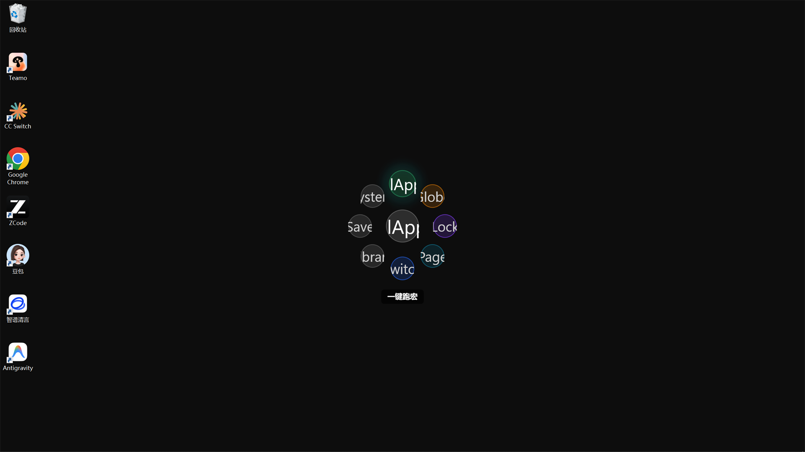

# Run Macros (Excel/WPS)

> Scenario: you rebuild the same spreadsheets in Excel/WPS every day. Goal: turn your macros into radial-menu actions — one flick and they run.

## Prerequisites

- Pulsar installed and onboarded (see the [previous chapter](01-install-and-first-run.md));
- Excel or WPS installed;
- A saved VBA macro (or the will to make one).

## Step 1: Open the Excel Macros Plugin

1. Open Pulsar Settings → Plugins;
2. Find **Excel Macros** and open its action configuration.

## Step 2: Bind a Macro to a Slot

1. Create a new slot with the "Run Excel Macro" action;
2. Fill in:
   - **Macro name**: the macro name saved in Excel/WPS (e.g. `MonthlyReport`);
   - **Target workbook** (optional): which workbook to run it in;
3. Place the slot in a **direction** on the radial menu — pick a comfortable one (e.g. right).

## Step 3: One-Click Execution

1. Open your workbook;
2. Press `Ctrl+Shift+Q`;
3. Flick toward the macro and release:

4. The macro runs in the target workbook automatically.

## Tips

- **Macro lives in multiple workbooks?** No copy-pasting VBA — Pulsar calls the macro inside the target workbook directly;
- **Cascading submenus**: group similar macros into a fan-out submenu to keep the main wheel clean;
- **Didn't run?** Run the macro manually in Excel first to confirm the macro itself works, then check the name spelling (case-sensitive).

## Next Steps

- [Sign Into Legacy Systems](03-legacy-systems.md) — automate repeated sign-ins and form filling too.
