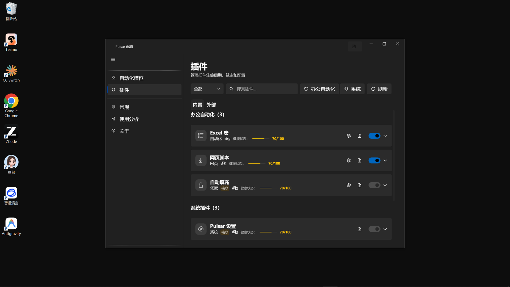
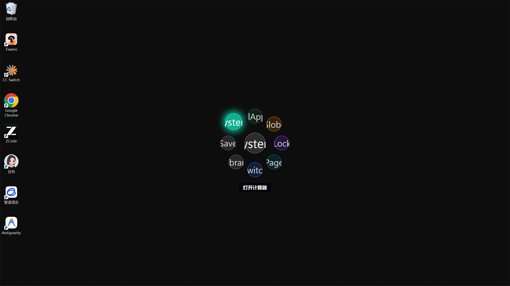

# 安装与首次运行

> 本页带你完成：下载 → 安装（或解压）→ 通过 SmartScreen → 首次启动 → 唤出第一个菜单。

## 1. 下载

前往 [Releases 页面](https://github.com/Smith-Rosco/Pulsar/releases) 选择对应版本：

| 版本 | 说明 | 适合谁 |
| :--- | :--- | :--- |
| **安装版（Setup.exe）** | 安装到 Program Files，带开始菜单入口与卸载条目 | 大多数用户，省心首选 |
| **独立版（Standalone zip）** | 自带 .NET 运行环境，解压即用，无需安装 | 免安装 / U 盘携带 / 无管理员权限环境 |

> 下载后请核对 Release 附带的 SHA256 清单（校验方法见 [FAQ](05-faq.md#如何校验下载文件的-sha256)）。

## 2. 安装

### 安装版

1. 双击 `Pulsar-v{version}-Setup.exe`；
2. Windows SmartScreen 弹出「Windows 已保护你的电脑」时：点击 **更多信息** → **仍要运行**（Pulsar 目前未购买代码签名证书，属正常现象）；
3. 按向导完成安装：默认安装到 Program Files，可选择「开机自启」；
4. 安装完成即自动启动 Pulsar，它会在系统托盘后台待命。

> 说明：安装需要管理员权限（写入 Program Files）。你的配置与数据保存在 `%AppData%\Pulsar`，**覆盖升级不会清除，卸载默认也会保留**。

### 独立版

1. 解压 `Pulsar-v{version}-Standalone-win-x64.zip` 到一个**固定文件夹**（如 `C:\Pulsar`，不要放在临时目录或下载目录）；
2. 双击 `Pulsar.exe` 运行。

## 3. 首次启动

首次启动会出现**新手引导**，建议跟完一遍（几分钟），你会学到：

- 如何唤出径向菜单（`Ctrl+Shift+Q` 命令模式 / `Ctrl+Q` 切换模式）；
- 如何朝目标方向滑动、松开触发动作；
- 如何在设置中添加自己的动作。

引导完成后，可以从「**办公动作预设包**」一键安装现成动作，也可以到「示例库」看看脚本示例。

## 4. 唤出第一个菜单

1. 在任意程序里按 **`Ctrl+Shift+Q`**；
2. 一个圆形菜单在你鼠标旁展开：

3. 朝目标动作的方向滑动并松开——动作立即执行。

## 5. 卸载

- **安装版**：Windows「设置 → 应用」中卸载，或开始菜单卸载入口；用户数据（`%AppData%\Pulsar`）默认保留并明示；
- **独立版**：直接删除解压目录即可；如需彻底清理，再删除 `%AppData%\Pulsar`。

## 下一步

- [我要跑宏（Excel/WPS）](02-run-macros.md)
- [我要登旧系统](03-legacy-systems.md)
- [我要切窗口](04-switch-windows.md)
