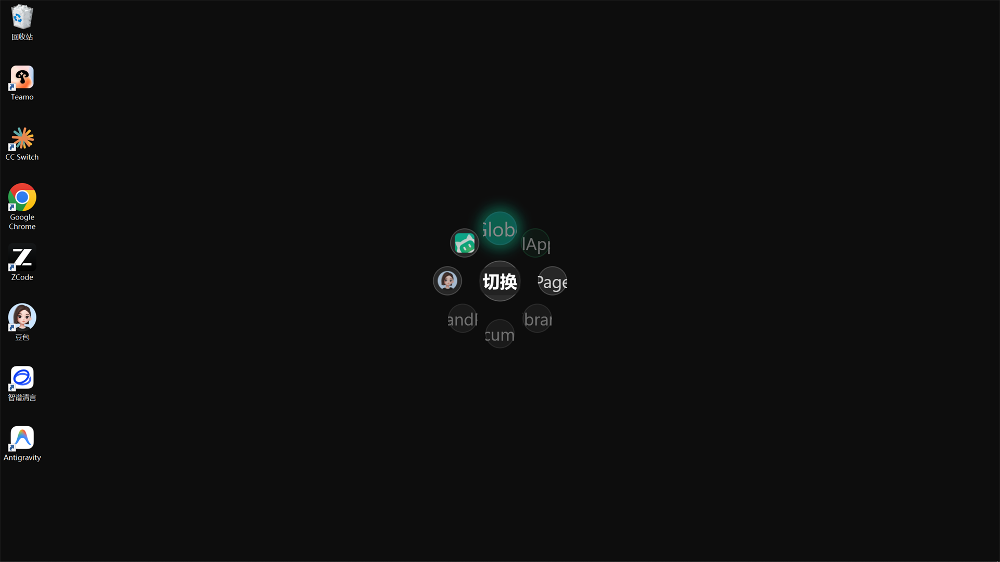

# 我要切窗口

> 场景：一天在五六个窗口之间来回横跳，Alt+Tab 按到眼花。目标：让每个常用窗口变成轮盘上的一个固定方位。

## 切换模式：`Ctrl+Q`

Pulsar 有两种菜单模式：

| 模式 | 热键 | 用途 |
| :--- | :--- | :--- |
| 命令模式 | `Ctrl+Shift+Q` | 触发宏、脚本、填表等动作 |
| **切换模式** | `Ctrl+Q` | **快速切换窗口** |

按 `Ctrl+Q` 唤出切换轮盘，每个方位对应一个应用：

朝目标应用方向滑动、松开——立即切过去。

## 添加一个切换目标

1. 设置 → 切换模式页；
2. 新建槽位，选择目标应用（从运行中的窗口挑选，或填写程序路径）；
3. 放到一个固定方位。

## 应用没开？自动帮你启动

切换槽位支持「**未运行则启动**」：目标应用没在运行时，滑动过去会自动把它启动并聚焦。把每天必开的应用（OA 客户端、Excel、浏览器）都放进切换轮盘，开机后一个键全部拉起。

## 小技巧

- **肌肉记忆**：方位固定后练几次就能「闭眼切」——这是径向菜单相对列表菜单最大的优势，别频繁挪动方位；
- **子菜单收纳**：应用太多就用级联子菜单按类别收纳（办公 / 浏览器 / 通讯），主轮盘只留高频项；
- **命令/切换配合**：先用 `Ctrl+Q` 切到目标应用，再用 `Ctrl+Shift+Q` 跑它的动作，两键完成一次完整作业。

## 下一步

- [常见问题](05-faq.md)
