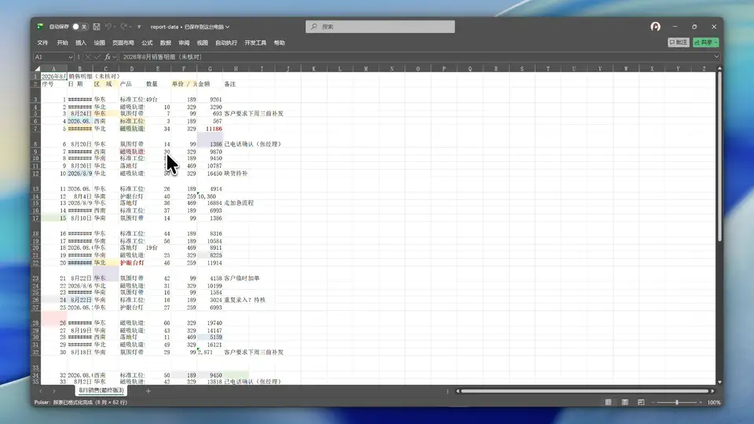
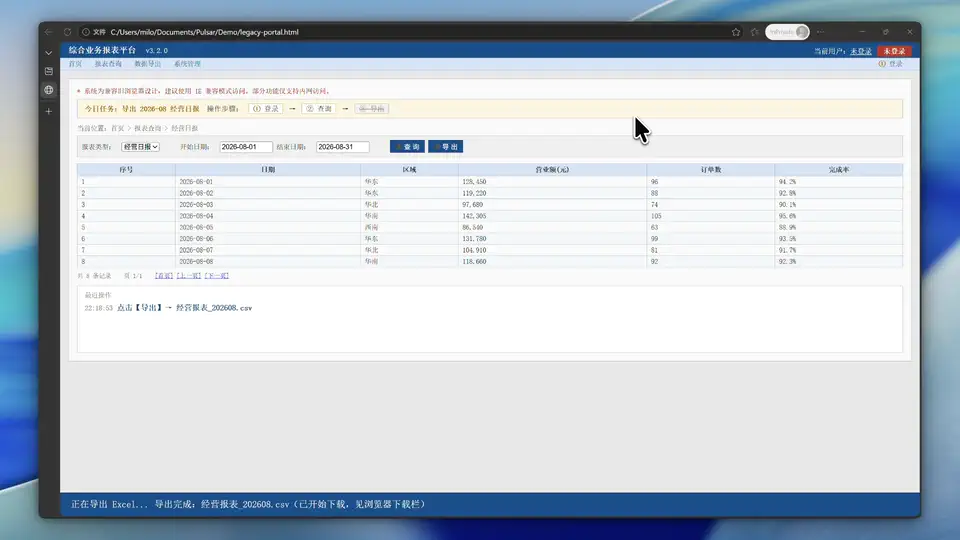
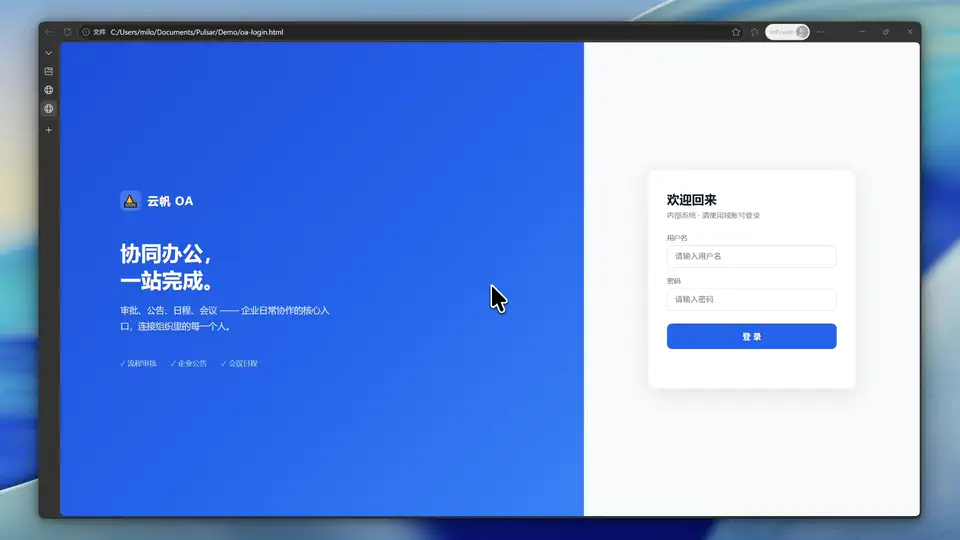

<picture>
  <source media="(prefers-color-scheme: dark)" srcset="Pulsar/Pulsar/Assets/Icons/pulsar-dark-256.png">
  
</picture>

# Pulsar

### 重度办公效率工作台 · 驯服老旧办公系统
**An office automation workbench for Windows — one-click macros, secure fill & sign-in, and custom scripts for legacy intranet web pages**

[-0078D4.svg?style=flat-square&logo=windows)](https://www.microsoft.com/windows)

 

**[简体中文](README.md)** • **[English](README_EN.md)**

 

[快速开始](#快速开始) · [它能做什么](#它能做什么) · [与同类工具对比](#与同类工具对比) · [演示](#演示) · [开发者](#开发者) · [社区与贡献](#社区与贡献)

---

## 这是什么

Pulsar 是 Windows 上的办公自动化工作台。按一下热键，圆形菜单在鼠标旁边展开，高频操作变成一次滑动就能触发。

它和搜索启动器、纯轮盘菜单、RPA 都不是一类东西。Pulsar 处理的是它们覆盖不到的部分：装不上浏览器扩展的老旧内网系统、每次都要手填的登录表单、Excel/WPS 里反复要跑的宏。

如果你每天在 Excel 里重复制表、在几个内网系统之间来回登录、反复填同一份表单，可以接着往下看。

---

## 快速开始

### 下载

两个包的区别只在于运行环境是否自带：

| 版本 | 说明 | 体积 |
| :--- | :--- | :--- |
| **独立版（full）** | 自带运行环境，解压即用 | ~80 MB |
| **轻量版（portable）** | 需先安装 [.NET 8 桌面运行时](https://dotnet.microsoft.com/download/dotnet/8.0) | ~8.5 MB |

大多数人选独立版；下载慢或者硬盘紧张时用轻量版。

- **独立版**：[Pulsar-1.11.0-full.zip](https://github.com/Smith-Rosco/Pulsar/releases/download/v1.11.0/Pulsar-1.11.0-full.zip)
- **轻量版**：[Pulsar-1.11.0-portable.zip](https://github.com/Smith-Rosco/Pulsar/releases/download/v1.11.0/Pulsar-1.11.0-portable.zip)
- 历史版本与更新记录：[Releases 页面](https://github.com/Smith-Rosco/Pulsar/releases)

### 使用

1. 解压到固定目录（如 `C:\Pulsar`），双击 `Pulsar.exe`，Pulsar 会在系统托盘后台待命；
2. 按 `Ctrl+Shift+Q` 唤出命令菜单，`Ctrl+Q` 进入切换模式；
3. 朝目标动作的方向滑过去，松开即执行；
4. 配置在设置里改。

> 首次启动有引导教程，跟着走一遍大概几分钟。

---

## 它能做什么

### 一键跑宏（Excel/WPS）

把常用的宏存成轮盘上的一个动作。之后做报表、整理数据不用再开 VBA 编辑器，滑一下就跑完。

### 老旧网页自动化

很多公司内网系统年代久远，装不了浏览器扩展或油猴脚本。Pulsar 从桌面层注入脚本，给这类网页加一键操作入口。

### 安全填表与登录

账号密码用 Windows DPAPI 加密存在本机，需要时一键注入并自动提交，明文不落地。注入走键盘层的文本注入，所以不限于网页，「账号框 + 密码框」的桌面软件登录窗同样适用。

### 径向菜单

- **命令模式**（`Ctrl+Shift+Q`）：展示当前可用的快捷动作；
- **切换模式**（`Ctrl+Q`）：切换窗口，没在跑的应用自动帮你启动；
- 动作方位固定，用熟之后可以凭肌肉记忆操作，不用在菜单里翻找。

  

### 内置工具

| 工具 | 说明 |
| :--- | :--- |
| **秘密填充** | 加密保存账号密码，一键注入任意窗口 |
| **应用切换器** | 窗口切换，未运行的应用自动启动 |
| **Pulsar 设置** | 打开设置、快捷添加上下文应用 |
| **命令启动器** | 启动应用 / 文件 / 文件夹 / 网址，还能给前台窗口发送按键 |
| **Excel 宏执行器** | 在 Excel/WPS 中运行已保存的宏 |
| **网页脚本执行器** | 在老旧内网网页中运行自定义脚本 |

### 上手

- 首次启动有引导教程，边看边点；
- 内置脚本编辑器与示例库，不会写也能从示例改起；
- 办公动作预设包可一键安装；
- 界面支持简体中文 / English。

---

## 与同类工具对比

选工具看的是要解决的问题，不是谁更强：

| 你需要 | 推荐工具 | 为什么 |
| :--- | :--- | :--- |
| 驯服老旧内网系统（宏 + 老网页 + 安全登录） | **Pulsar** | 为老旧办公系统设计：桌面层脚本注入 + DPAPI 加密凭据注入 + 固定方位径向菜单 |
| 万能按钮面板 + 海量现成动作 | [Quicker](https://getquicker.net) | 社区共享动作库生态最强，上下文面板好用；闭源，免费版有每日触发限制 |
| 键盘党搜文件、搜一切 | [Flow Launcher](https://www.flowlauncher.com) · [Microsoft PowerToys](https://learn.microsoft.com/windows/powertoys/)（Run / Command Palette） | 搜索启动器标杆；Pulsar 不做搜索框，和它们互补 |
| 跨平台 / 纯轮盘菜单 | [Kando](https://github.com/kando-menu/kando) · [StarPie](https://github.com/SoftBlack42/StarPie) · [RadialActions](https://github.com/danielchalmers/RadialActions) | 开源轮盘 / 环形菜单，启动应用、文件、快捷键都好用，不含办公自动化 |
| 长链条、跨系统的重型流程自动化 | Power Automate Desktop · 影刀 RPA | 专业 RPA 工具；Pulsar 只做一滑就完事的高频小动作，超出范围时它们是升级路径 |

---

## 演示

### 一键跑宏

一张典型的脏表：格式不统一、配色混乱、列宽不合理。呼出轮盘，滑向「一键跑宏」松开，脚本自动跑完：统一字体、清掉多余配色、列宽自适应、冻结表头。

  

> 不会写宏？把 [VBA 脚本 AI 提示词](./Docs/guides/AI_PROMPT_VBA_RUNNER.md) 整段喂给 AI，描述你的需求，就能拿到能直接跑的宏脚本。

### 驯服老旧系统

这个内网报表系统十年没升级，登录 → 查询 → 导出每一步都要手点。用 Pulsar 只做一次呼出、滑动、松开，三步跑完，CSV 自动下载。

  

> 不会写脚本？[网页脚本 AI 提示词](./Docs/guides/AI_PROMPT_BOOKMARKLET.md) 整段喂给 AI 即可，还附了一份「页面改版回验清单」。

### 一滑登录

先手动输一遍账号密码，然后清空，滑向轮盘的登录方位，账号密码自动注入并提交。

  

---

## 开发者

Pulsar 用 MIT 开源，欢迎贡献代码、插件与建议。

- **[用户手册](./Docs/manual/README.md)**：安装、跑宏、登旧系统、切窗口、常见问题（中英双语）；
- **[开发文档（DEVELOPER.md）](./DEVELOPER.md)**：技术栈、项目结构、构建 / 测试命令、插件开发与架构设计；
- **[架构详解](./ARCHITECTURE.md)** · **[插件开发指南](./PLUGIN_DEVELOPMENT.md)** · **[完整文档索引](./Docs/README.md)**；
- 贡献前请阅读 [CONTRIBUTING.md](./Docs/CONTRIBUTING.md)。

插件分核心（Core）与扩展（Extension）两类：核心插件不可禁用，扩展插件带熔断器，一分钟内崩溃三次就临时停用 60 秒，不会拖垮主程序。

---

## 社区与贡献

- **更新日志**：[CHANGELOG.md](./CHANGELOG.md) — 版本更新记录
- **贡献指南**：[CONTRIBUTING.md](./Docs/CONTRIBUTING.md) — 如何参与贡献
- **安全问题**：通过 GitHub Issue 或邮件报告安全问题

---

## 路线图

Pulsar 仍在活跃开发，核心功能与插件体系已趋于稳定。「用一句话描述场景、由 AI 生成轮盘动作配置」在探索中，暂无排期，现有的本地自动化能力不依赖它。

---

## 开源许可证

本项目采用 [MIT License](LICENSE) 开源。
