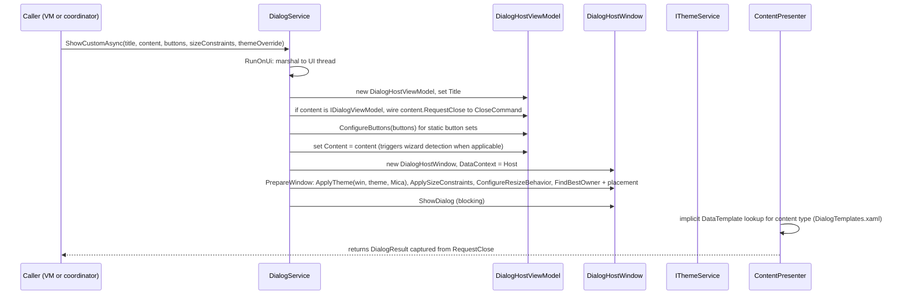

# Dialog System Architecture

Pulsar runs all dialogs — confirmations, input prompts, pickers, secret management, and the slot create/edit wizard — through one unified host: `DialogService` creates a single `DialogHostWindow` (`Wpf.Ui` `FluentWindow`) whose `ContentPresenter` renders whatever content object the service was handed, and whose fixed header/footer chrome comes from the host view model. Standalone `Window` subclasses for dialogs are deprecated (AGENTS.md and `Docs/architecture/DIALOG_SYSTEM.md` both enforce this). The architecture review 2026-09-04 added `SettingsDialogFlows` as the single recipe owner for the Settings window's "show → confirm → dispatch" sequences, while `DialogHostViewModel` remains the dialog shell for every path.

## Responsibilities and Entry Points

`IDialogService` (`Pulsar/Pulsar/Services/Interfaces/IDialogService.cs`) is registered as a singleton in `App.xaml.cs` (`AddSingleton<IDialogService, DialogService>()`) and injected into `SettingsViewModel`, `AppStartupCoordinator`, `SettingsDialogFlows`, `PluginViewModel`, `AboutViewModel`, and dialog content view models that open nested dialogs (`SecretPickerViewModel`, `EditProfileViewModel`, `InputProfileViewModel`, `PluginSettingsDialogViewModel`). The entry points:

| Method | Content | Default size | Purpose |
|---|---|---|---|
| `ShowMessageAsync(title, message, type, buttons)` | plain `string` | XSmall (Small for `SaveDontSaveCancel`) | Icon-titled message box; `DialogType` is captured on the host VM to drive the documented icon and button semantics |
| `ShowConfirmationAsync(title, message, confirmText?, cancelText?)` | plain `string` | XSmall | Two-button Yes/Confirm dialog |
| `ShowInputAsync(title, message, defaultValue)` | `InputDialogViewModel` | Small | Single text input, returns `string?` |
| `ShowColorPickerAsync(title, initialColor)` | `ColorPickerViewModel` | Medium | Returns hex string or null |
| `ShowCustomAsync<T>(title, content, buttons, sizeConstraints?, themeOverride?)` | any `object` | Medium default | The general path for every custom VM |

All public methods marshal onto the UI thread via `RunOnUi` (a `Func<T>` executed on `Application.Current.Dispatcher`, awaited when called off-thread) before touching any window.

## The ShowCustomAsync Flow

Caption: `ShowCustomAsync` builds a `DialogHostViewModel`, opens a theme/size-configured `DialogHostWindow`, and returns the `DialogResult` the content view model produced via `RequestClose`.

Mechanics behind the diagram:

- `DialogService.ShowCustomAsync` wires `content.RequestClose` to the host's `CloseCommand` when the content implements `IDialogViewModel`, then sets `vm.Content = content` (`Pulsar/Pulsar/Services/DialogService.cs#L88-L104`). WPF's `ContentPresenter` resolves the content type against the implicit `DataTemplate` catalog in `Themes/DialogTemplates.xaml`.
- `ShowDialogInternal` creates `new DialogHostWindow()` directly — no DI needed by the window — captures the result in a local via the `RequestClose` handler (`viewModel.RequestClose = r => { result = r; window.Close(); }`), applies `PrepareWindow`, then calls `window.ShowDialog()` and returns the captured `DialogResult` (`Pulsar/Pulsar/Services/DialogService.cs#L347-L373`).
- `DialogResult` (`Pulsar/Models/Enums/DialogResult.cs`) is `None, Confirmed, Cancelled, Yes, No, Custom`; callers branch on `== DialogResult.Confirmed` to commit side effects.
- `SettingsDialogFlows.RunAsync` is the Settings recipe: it shows the dialog and runs an `onConfirmed` delegate with the same view-model instance only when the result is `Confirmed` (`Pulsar/Pulsar/ViewModels/Settings/SettingsDialogFlows.cs#L38-L62`). Tests (`Pulsar.Tests/ViewModels/SettingsDialogFlowsTests.cs`) pin "confirmed runs delegate, any other result skips it" and that the no-constraints overload is used when none is supplied.

## DialogHostWindow: One Shell, Three Rows

`DialogHostWindow.xaml` is a borderless `FluentWindow` (`WindowStyle="None"`, `ExtendsContentIntoTitleBar="True"`, `WindowBackdropType="Mica"`, `ShowInTaskbar="False"`) laid out as a three-row grid:

1. `ui:TitleBar` bound to `Title`, with `ShowMaximize`/`ShowMinimize` bound to the window's `ShowMaximizeButton` dependency property.
2. `ContentPresenter` bound to `Content` with fixed margins (`Pulsar.Thk.L20T12R20B16`).
3. Footer with up to three `ui:Button`s: tertiary (danger-styled "Don't Save"/"No"), secondary ("Cancel"/"Back"), primary ("OK"/"Next"/"Confirm", `IsDefault="True"`). Tertiary executes `CloseCommand` with `DialogResult.No`; secondary and primary bind `WizardSecondaryCommand` / `WizardPrimaryCommand` (`Pulsar/Pulsar/Views/Dialogs/DialogHostWindow.xaml`).

Code-behind (`DialogHostWindow.xaml.cs`) contributes two behaviors:

- **Esc handling**: `KeyDown` (not `PreviewKeyDown`) routes Escape to `DialogHostViewModel.CancelFromKeyboard()`. Using the bubbling event deliberately lets controls like `HotkeyBox` intercept Escape first.
- **Resize guard**: `OnStateChanged` restores `WindowState.Normal` if the window maximized while `ResizeMode` is `NoResize` — this is why non-`LargeResizable` dialogs can never maximize even via OS shortcuts.

## DialogHostViewModel: Footer, Wizard Mode, Close Gate

`DialogHostViewModel` (`Pulsar/Pulsar/ViewModels/DialogHostViewModel.cs`) owns the chrome state and the close contract:

- **Static buttons**: `ConfigureButtons(DialogButtons)` maps `Ok`, `OkCancel`, `YesNo`, `YesNoCancel`, `SaveDontSaveCancel`, `None` onto visibility + localized labels (via `ILocalizationService` with English fallbacks). `SaveDontSaveCancel` sets `UseDangerStyleForTertiary = true`, which the `PulsarTertiaryDialogButtonStyle` data trigger in `DialogHostWindow.xaml` turns into a red critical brush.
- **Wizard mode**: when `Content` changes to an `IWizardDialogViewModel`, the host subscribes to its `PropertyChanged` and mirrors `IsPrimaryButtonVisible`, `PrimaryButtonText`, `IsSecondaryButtonVisible`, `SecondaryButtonText` from the wizard (`SyncFromWizard`). `WizardPrimaryCommand`/`WizardSecondaryCommand` delegate to the wizard's `PrimaryCommand`/`SecondaryCommand`; in normal mode they close with `Confirmed`/`Cancelled`. `CancelFromKeyboard` delegates to the wizard's secondary command when a wizard is active (the "Back"/"Skip" step), otherwise closes as `Cancelled`.
- **Close gate**: `CloseCommand(result)` first awaits `content.CanCloseAsync(result)` when content is an `IDialogViewModel`; a `false` return aborts the close — this is the validation hook (`SlotEditorViewModel.CanCloseAsync` returns false on `Confirmed` while a blocking validation issue exists, `FirstLaunchSetupWizardViewModel.CanCloseAsync` marks onboarding skipped on `None`).

`IWizardDialogViewModel : IDialogViewModel, INotifyPropertyChanged` (`Pulsar/Pulsar/ViewModels/Base/IWizardDialogViewModel.cs`) adds the four footer-driving members plus `PrimaryCommand`/`SecondaryCommand`. Wizard implementations today: `SlotEditorViewModel` (label → action → required details → optional settings, validation-driven focus) and `FirstLaunchSetupWizardViewModel` (first-run onboarding, language + usage scenario).

The footer test coverage in `Pulsar.Tests/ViewModels/DialogHostViewModelLocalizationTests.cs` pins the localization behavior (`ConfigureButtons` uses localized labels, falls back to English without a localization service) and the Esc contract (normal dialogs close as `Cancelled`; wizard mode delegates to the secondary command).

## DialogSizeConstraints: The Two Hard Invariants

AGENTS.md and `Docs/architecture/DIALOG_SYSTEM.md` list two hard rules for adding a dialog: every dialog view model needs `DialogSizeConstraints`, and its content `UserControl` must be registered as an implicit `DataTemplate` in `DialogHostWindow.xaml` (the catalog actually lives in `Themes/DialogTemplates.xaml`, merged into the window resources).

`DialogSizeConstraints` (`Pulsar/Pulsar/Models/DialogSizeConstraints.cs`) is a plain options object (`Width`, `Height`, `MinWidth`, `MinHeight`, `MaxWidth`, `MaxHeight`, `SizeToContent`, `AllowResize`, `ShowMaximizeButton`) plus static presets:

| Preset | Size | Resizable | Maximize | Use |
|---|---|---|---|---|
| `XSmall` | 350×200 | no | no | simple confirmations |
| `Small` | 380×240 | no | no | single input, detailed confirmations |
| `Medium` | 600×450 | no | no | forms and pickers |
| `Large` | 800×600 | yes | no | complex content |
| `LargeResizable` | 800×600 | yes | yes | lists needing full screen |
| `Auto` | size-to-content | no | no | rare |
| `Default` | 600×450 | no | no | fallback when null |

`DialogService.ApplySizeConstraints` maps the object onto the window's sizing properties (`SizeToContent.WidthAndHeight` for `Auto`), and `ConfigureResizeBehavior` maps `AllowResize` → `ResizeMode.CanResize`/`NoResize` plus the `ShowMaximizeButton` dependency property (`Pulsar/Pulsar/Services/DialogService.cs#L288-L317`, `Pulsar/Pulsar/Views/Dialogs/DialogHostWindow.xaml.cs#L60-L67`). The unparameterized `ShowCustomAsync` overload defaults to `Medium` — the docs explicitly discourage relying on it for custom dialogs. Custom constraints are also used directly, e.g. `AddSlotDialog` opens `SlotEditorViewModel` with an inline 860×700 resizable/maximizable constraint rather than a named preset (`Pulsar/Pulsar/ViewModels/SettingsViewModel.cs#L407-L417`).

## The DataTemplate Catalog

`DialogHostWindow.xaml` merges `Themes/DialogTemplates.xaml` into its resources. That dictionary is the implicit-template catalog: one `DataTemplate DataType="{x:Type dialogs:XxxViewModel}"` per content view model, each instantiating the matching `UserControl` from `Views/Dialogs/Contents/` (`Pulsar/Pulsar/Themes/DialogTemplates.xaml`). It also defines the default `sys:String` template so plain-string messages render as a wrapped `TextBlock`.

Missing registration is the classic failure mode: WPF's `ContentPresenter` falls back to `ToString()` and the dialog displays the view model's fully qualified type name instead of the UI. Adding a dialog therefore always touches: `ViewModels/Dialogs/` (implementing `IDialogViewModel`), `Views/Dialogs/Contents/` (the `UserControl`), the catalog, and a `ShowCustomAsync` call with constraints.

The catalog includes (with their content views): `ProcessBlacklistViewModel` → `ProcessBlacklistContent`, `ColorPickerViewModel` → `ColorPickerContent`, `IconPickerViewModel` → `IconPickerContent`, `InputDialogViewModel` → `InputDialogContent`, `InputProfileViewModel` → `InputProfileContent`, `EditProfileViewModel` → `EditProfileContent`, `PluginLogViewerViewModel` → `PluginLogViewerContentHost`, `ProcessPickerViewModel` → `ProcessPickerContent`, `QuickSecretsViewModel` → `QuickSecretsContent`, `SlotEditorViewModel` → `AddSlotContent`, `SecretPickerViewModel` → `SecretPickerContent`, `PluginSettingsDialogViewModel` → `PluginSettingsDialogContent`, `WindowInspectorViewModel` → `WindowInspectorContent`, `FirstLaunchSetupWizardViewModel` → `FirstLaunchSetupWizardContent`, `ConfigBackupOptionsViewModel` → `ConfigBackupOptionsContent`, `BookmarkletScriptEditorViewModel` → `BookmarkletScriptEditorContent`, `ExampleLibraryViewModel` → `ExampleLibraryContent`.

Nested-dialog chaining works because content view models receive `IDialogService` themselves: `SecretPickerViewModel` opens `QuickSecretsViewModel` (create/edit) and `ShowConfirmationAsync` (delete) while it is itself a dialog (`Pulsar/Pulsar/ViewModels/Dialogs/SecretPickerViewModel.cs#L121-L200`); `SlotEditorViewModel`'s picker delegates (`PickSlotParameterValue`, `PickIcon`, `PickColor`) open `ProcessPickerViewModel` / `IconPickerViewModel` / `ColorPickerViewModel` on top of the slot wizard via `SettingsViewModel`.

## Theme Injection: ApplyTheme After InitializeComponent

Pulsar's `App.xaml` deliberately has no global styles ("Multi-Headed" UI). Every window and page must inject theme resources through `IThemeService.ApplyTheme`, and the ordering rule is a hard invariant from `Docs/lessons/WPF_THEME_INJECTION_PITFALLS.md`: **call `ApplyTheme()` only after `InitializeComponent()`**. If a `Page`/`UserControl` defines its own resources, WPF can replace the `Resources` dictionary instance during XAML load; applying a theme first discards the injected `ThemesDictionary`, `ControlsDictionary`, and Pulsar `Themes/Theme.*.xaml`.

For dialogs, `DialogService.PrepareWindow` applies the theme after window construction (the window's `InitializeComponent` already ran inside its constructor):

- `ThemeService.ApplyTheme(window, theme, backdrop)` uses `ApplyStandardTheme` for standard windows: it updates an existing `ThemesDictionary` in place when present (avoiding destructive clear/re-add that triggers "NaN" animation crashes), ensures a `ControlsDictionary`, and swaps the Pulsar `Theme.Light.xaml`/`Theme.Dark.xaml` dictionary by removing any existing `/Themes/Theme.` dictionary and adding the correct one last so Pulsar keys win over Fluent defaults (`Pulsar/Pulsar/Services/ThemeService.cs#L241-L284`).
- The theme comes from `themeOverride` if provided (the first-run wizard forces `AppTheme.Light` at startup via `AppStartupCoordinator`), otherwise `InferThemeFromContext()` returns `_themeService.CurrentTheme`.
- Accent brushes (`AccentFillColorDefaultBrush`, ...) are bridged into `Application.Current.Resources` from WPF-UI's runtime accent manager so `{DynamicResource Accent*}` references resolve in every window and dialog (`ThemeService.ApplyAccent`/`BridgeAccentResources`).

Because `ApplyTheme` mutates merged dictionaries on the window, the ordering invariant for dialogs is automatically satisfied by `PrepareWindow`; content `UserControl`s rely on the host window's injected theme via resource inheritance, so they must not call `ApplyTheme` themselves.

## Placement and Backdrop

`PrepareWindow` also computes placement. `FindBestOwner` implements the documented priority: active visible non-minimized window → open `SettingsWindow` → visible `MainWindow` → any visible window; `CenterScreen` and `NearMouse` return no owner (`Pulsar/Pulsar/Services/DialogService.cs#L161-L199`). `ApplyPlacement` maps `DialogPlacement`:

- `CenterOwner` (default): `CenterOwner` startup location with the found owner.
- `CenterScreen`: no owner, centered on screen.
- `CenterActiveWindow`: owner = currently active window.
- `NearMouse`: manual position computed from `GetCursorPos`, converted to DIP, offset 20 px from the cursor, and clamped to the nearest monitor's work area (excluding the taskbar) via `PulsarNative` monitor APIs.

All dialogs default to a `Mica` backdrop; `EnforceTransparency` (WindowStyle.None + DWM system-backdrop `DWMSBT_NONE`) is the separate seam used by the radial menu window.

## The Slot / Secret / Picker Catalog

The most complex hosted flows, all driven by `IDialogService`:

- **Slot create/edit** (`SlotEditorViewModel` + `AddSlotContent`): an `IWizardDialogViewModel` whose footer shows localized `Save Slot` / `Cancel` and whose `CanCloseAsync` blocks `Confirmed` closes while a blocking validation issue exists. `AddSlotContent` subscribes to the view model's `PropertyChanged` and, on `ValidationRequestId` changes, scrolls and focuses the first invalid target (the action section's first control, or the offending field's primary button) — implementing the field-level-validation contract from `Docs/guides/CREATE_SLOT_DIALOG_GUIDELINES.md`. Create mode uses `DialogButtons.None` (the wizard owns the footer) with an inline 860×700 resizable constraint; edit mode (`OpenSlotConfiguration`) uses `LargeResizable`. `DialogSlotEditorViewModelTests` pin the picker→configuration phases and save semantics.
- **First-run wizard** (`FirstLaunchSetupWizardViewModel` + `FirstLaunchSetupWizardContent`): an `IWizardDialogViewModel` shown by `AppStartupCoordinator.RunOnboardingStartupAsync` with `DialogButtons.None`, `LargeResizable`, and a forced `AppTheme.Light` override. Its `FinishCommand` writes the onboarding template through `ConfigEditSession` and closes `Confirmed`; `SkipCommand` marks onboarding skipped and schedules smart detection.
- **Secret flows** (`SecretPickerViewModel` → `SecretPickerContent`, `QuickSecretsViewModel` → `QuickSecretsContent`): the picker merges persisted and pending secrets, and its Add/Edit commands open `QuickSecretsViewModel` in nested `ShowCustomAsync` dialogs, committing pending payloads before refreshing the list; delete goes through `ShowConfirmationAsync`.
- **Pickers**: `IconPickerViewModel` (`LargeResizable`), `ProcessPickerViewModel` (`LargeResizable`), and `ColorPickerViewModel` (`Medium`) are the composable building blocks reused by `EditProfileViewModel`, `InputProfileViewModel`, `SlotEditorViewModel` delegates, and Settings flows. `PluginLogViewerViewModel` uses `Large` with `PluginLogViewerContentHost`.

## Failure Semantics and Safe-Change Checklist

- Missing DataTemplate registration renders the fully qualified view-model type name instead of the content UI — the most common integration failure.
- Missing size constraints silently fall back to `Medium` for custom dialogs and `Default` (600×450) when null — cramped or oversized layouts are a UX regression, not an error.
- `CanCloseAsync` returning `false` silently swallows the close: `Save Slot` with validation errors keeps the dialog open, and the wizard's footer state is restored via `SyncFromWizard` on the next property change.
- Non-`LargeResizable` dialogs cannot maximize: `ResizeMode.NoResize` plus the `StateChanged` guard.
- Dialog content view models must not call `IThemeService.ApplyTheme` themselves; the host window's injected resources are inherited, and a manual call could replace the window's merged dictionaries at an inopportune time.
- Adding a dialog touches exactly four places: the `IDialogViewModel` in `ViewModels/Dialogs/`, the `UserControl` in `Views/Dialogs/Contents/`, the implicit `DataTemplate` entry in `Themes/DialogTemplates.xaml`, and a `ShowCustomAsync` call that always passes explicit `DialogSizeConstraints`.

## Related Pages

- `/openwiki/architecture/settings-and-slot-editor.md` — SettingsViewModel and the slot editor flows that host `SlotEditorViewModel`
- `/openwiki/architecture/radial-menu-session.md` — the radial menu window, the other FluentWindow host with its own theme seam
- `/openwiki/architecture/config-system.md` — `ConfigEditSession`, the write path the first-run wizard and settings flows commit through
- `/openwiki/concepts/theme-and-rendering.md` — `ThemeService` and the ApplyTheme discipline
- `/openwiki/workflows/config-edit-and-save.md` — the user-visible edit-and-save workflow that dialogs participate in
