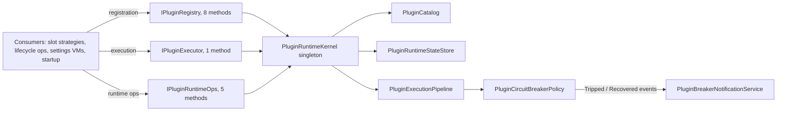
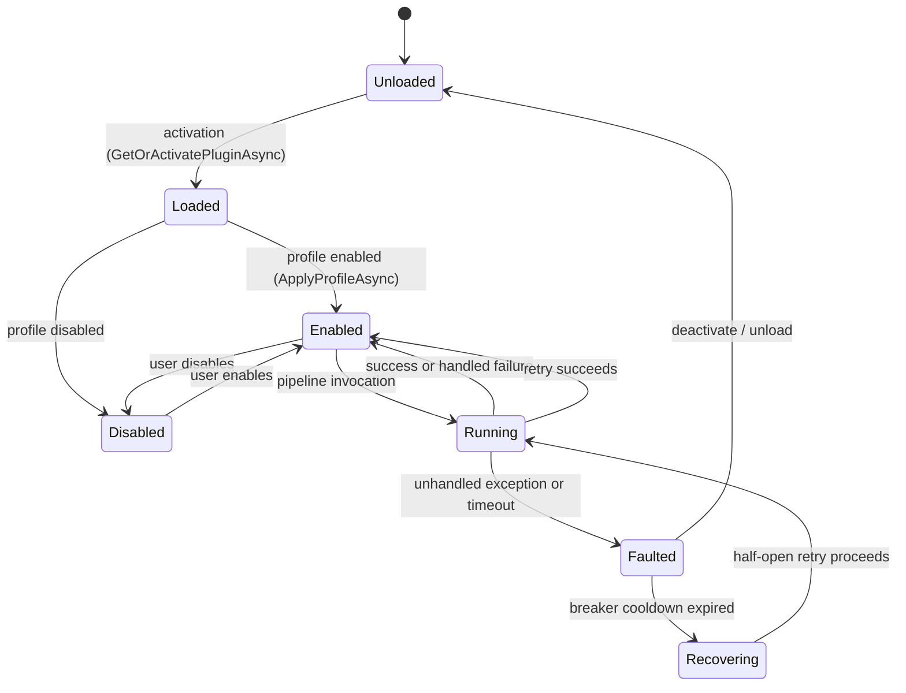
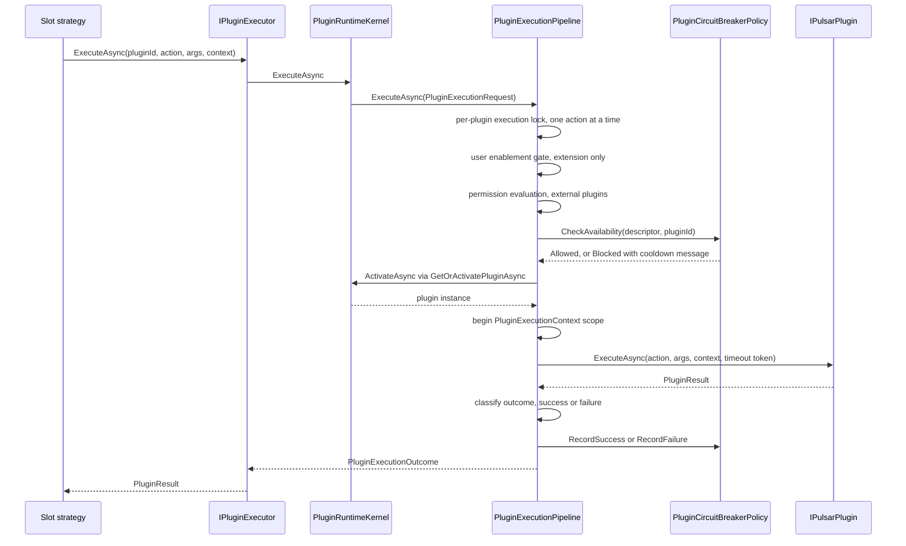
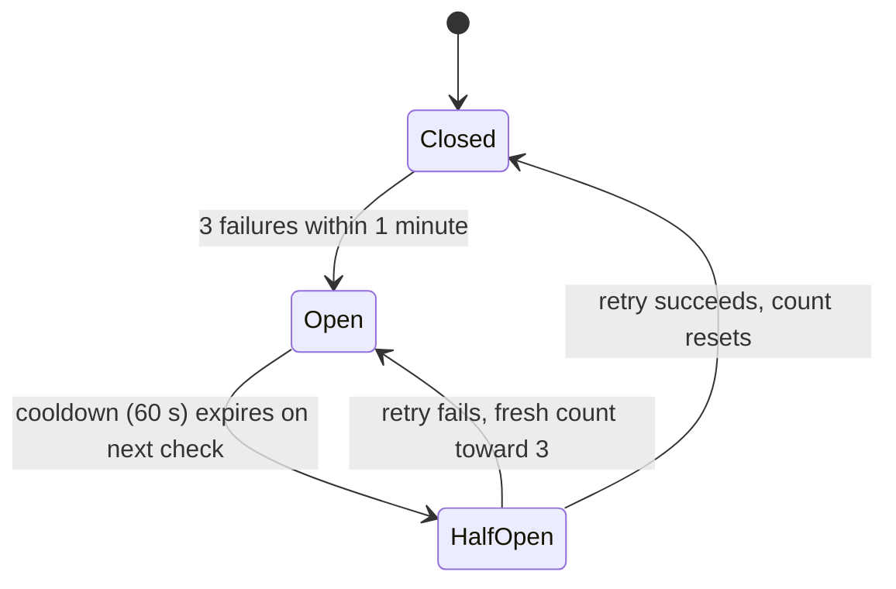

# Plugin System Architecture

Pulsar's application shell is deliberately thin — **Capture Context → Dispatch Tasks → Render Feedback** — and every business capability is implemented as a plugin. The plugin runtime is a single deep module (`PluginRuntimeKernel`) with narrow consumer seams, two failure tiers (core fatal vs. extension brokered), a validated lifecycle state machine, and an execution pipeline that applies enablement, permissions, circuit-breaker availability, and timeouts in a fixed order before invoking plugin code.

## Plugin Tiers: Core vs. Extension

Every plugin carries a `PluginTier` (declared via `IPluginTiered` or derived from `CanDisable`), and the tier determines the failure contract:

| Tier | Failure semantics | Disable-ability | Examples |
|---|---|---|---|
| **Core** | Crashes are **fatal**: the pipeline routes exceptions/timeouts to `ICorePluginFailureHandler`; the default `RethrowCorePluginFailureHandler` rethrows the original exception. No circuit-breaker protection. | Cannot be disabled — `SetPluginStateAsync` refuses, `IsPluginEnabled` always returns true | PKI (`com.pulsar.pki`), WinSwitcher (`com.pulsar.winswitcher`) |
| **Extension** | Crashes are **isolated**: the circuit breaker counts failures, opens the circuit, and blocks further execution for the cooldown. | Can be disabled per user profile | VbaRunner, BookmarkletRunner, Command |

The tier gates every decision point in the pipeline: `PluginCircuitBreakerPolicy.CheckAvailability` / `RecordSuccess` / `RecordFailure` are no-ops for Core plugins, and the pipeline branches on `descriptor.Tier` when a plugin throws, times out, or returns a Critical result. `PluginLoader.CreateExternalDescriptor` throws if an external package declares the Core tier — external packages can only ever be Extension plugins.

## The Three Narrow Runtime Seams (ADR-012)

An architecture review found the former consumer surface was a wide facade: `IPluginRegistry` with 14 methods spanning discovery, activation, execution, runtime-state mutation, and teardown, wrapped by a pass-through `PluginRegistry` class that added an indirection and concentrated no logic. ADR-012 split the surface along consumer populations into three seams and deleted the wrapper:

| Seam | Consumer population | Methods |
|---|---|---|
| **Registration** `IPluginRegistry` | Discovery/startup, config validation, recommendation engine, usage read-model, menu wiring | `LoadCoreAsync`, `DiscoverDeferredAsync`, descriptor/instance queries, `GetOrActivatePluginAsync`, `IsPluginEnabled` (8) |
| **Execution** `IPluginExecutor` | Slot execution hot path — `PluginActionStrategy` and its creators | `ExecuteAsync` (1) |
| **Runtime ops** `IPluginRuntimeOps` | `ExternalPluginLifecycleOps`, Settings/analytics disable, exit-path unload | `RefreshDiscoveryAsync`, `DeactivatePluginAsync`, `SetPluginStateAsync`, `GrantPermissionsAsync`, `UnloadAllAsync` (5) |

Caption: the module graph is one deep kernel behind three narrow seams; the breaker announces transitions and one observer adapter owns the side effects.

The governing **DI rule**: consumers inject the narrowest seam that matches their role and never the concrete `PluginRuntimeKernel`. `AddPluginRuntime` registers all three interfaces to the **same kernel singleton**, so the seams are compile-time contracts, not separate service instances:

- Execution hot path → `IPluginExecutor`: `PluginActionStrategy` (and `CommandPageProvider`, `ProcessPageProvider`, `CascadeSubMenuStrategy` that construct it).
- Lifecycle orchestration → `IPluginRuntimeOps` + `IPluginRegistry`: `ExternalPluginLifecycleOps` runs ops primitives through the ops seam and descriptor/activation queries through the registry seam.
- Settings & analytics → `IPluginRuntimeOps` for disable/state (`PluginViewModel`, `PluginManagerViewModel`, `ExternalPluginViewModel`, `ExternalPluginManagerViewModel`, `SettingsAnalyticsPageViewModel`); the analytics read-model keeps `IPluginRegistry.GetAllPlugins`.
- Exit path → `IPluginRuntimeOps.UnloadAllAsync` (`App.OnExit`).
- Registration-only consumers keep `IPluginRegistry`: `AppStartupCoordinator`, `ConfigValidationPipeline`, `PluginRecommendationEngine`, `UsageStatsReadModel`, `MenuSession`, `Pulsar.Simulator` (its invocation resolves `IPluginExecutor`).

Tests construct the kernel directly (`new PluginRuntimeKernel(...)`) and mock `IPluginExecutor` / `IPluginRuntimeOps` at the seam boundary, which locks the split in the sequence assertions.

## Runtime Internals

`PluginRuntimeKernel` is the single implementation of all three seams and the orchestration owner. It composes five collaborator types:

- **`PluginCatalog`** — the descriptor registry (`PluginDescriptor` records: Id, DisplayName, Version, Tier, `IsExternal`, `Permissions`, `Dependencies`, `Metadata`, `IsConfigurable`, and the `ImplementationType` used at activation). `RemoveDescriptor` drops entries at runtime uninstall so stale descriptors cannot keep referencing types from an unloaded assembly.
- **`PluginRuntimeStateStore`** — authoritative lifecycle state: an instance dictionary plus immutable `PluginRuntimeSnapshot`s (State, `LastError`, `LoadedAtUtc`, `UnloadedAtUtc`). Only validated `Transition()` calls write snapshots; a pure read of a plugin with no recorded lifecycle derives `Loaded` (instance registered) or `Unloaded` on demand and never materializes it.
- **`PluginExecutionPipeline`** — deterministic execution ordering (below).
- **`PluginCircuitBreakerPolicy`** — pure breaker state machine (below).
- **`PluginLoader`** — discovery and activation; owns the collectible-ALC teardown for external plugins.

`AddPluginRuntime` wires these as container singletons together with `PluginBreakerNotificationService`, and maps the three seam interfaces to the kernel.

## Lifecycle State Machine

States: `Unloaded` (no live instance attached), `Loaded` (instance exists and settings applied), `Enabled` (ready to execute), `Disabled` (instance may remain loaded but execution is blocked), `Running` (action actively executing), `Faulted` (activation or execution failed), `Recovering` (breaker cooldown expired, retry path allowed).

Caption: the validated plugin lifecycle; `Faulted` and `Unloaded` are terminal/recovery states reachable from any prior state.

`PluginRuntimeStateStore.Transition` enforces the edges: same-state re-entry is always allowed; `Loaded` only from `Unloaded`/`Faulted`; `Disabled` only from `Loaded`/`Enabled`/`Running`; `Running` only from `Enabled`/`Faulted`/`Recovering`; `Recovering` only from `Faulted`. An invalid transition throws `InvalidOperationException`, and rejected transitions leave no trace in the snapshot dictionary.

Activation (`GetOrActivatePluginAsync`) is idempotent and gated per plugin: concurrent requests for the same plugin share a `SemaphoreSlim`, so exactly one instance is created — without the gate, each request would create its own instance and the second would overwrite runtime state, losing lifecycle hooks. The flow is: `PluginLoader.ActivatePlugin` (factory creates the instance via constructor injection, then `Initialize(services)`), state → `Loaded`, then `ApplyProfileAsync` applies the persisted profile. Activation failure transitions the plugin to `Faulted` and returns null.

`ApplyProfileAsync` is **read-only**: it applies the user's persisted profile (or defaults: enabled) and never writes back to `Profiles.json` — activating a plugin is not a configuration change. Core plugins always end `Enabled` (running `OnEnableAsync`); extensions end `Enabled` or `Disabled` per profile; `IPluginConfigurable` settings are validated first, falling back to defaults on invalid config.

## Execution Pipeline

Caption: the fixed execution order every plugin action passes through, from slot strategy to outcome classification.

Every execution runs the same ordered stages:

1. **Per-plugin mutex** — one action per plugin at a time (default policy); a concurrent request is immediately blocked with `PluginErrorCode.TemporaryUnavailable`. A plugin that needs reentrancy must be refactored to a background queue, not concurrent mutation.
2. **Enablement gate** — for extensions, `IsEnabled()` (persisted profile) is checked before anything else; disabled → `Blocked`.
3. **Permission evaluation** — `IPluginPermissionService.Evaluate(descriptor, grantedPermissions)`; a missing or unknown manifest permission blocks execution with `AccessDenied` before the plugin is activated or invoked.
4. **Breaker availability** — `CheckAvailability`; an open circuit returns `Blocked` with a "disabled for safety, retry in Ns" message; a cooldown that just expired moves the state to `Recovering` and allows the request through.
5. **Activation** — `ActivateAsync` (`GetOrActivatePluginAsync`); a null instance blocks.
6. **Execution scope** — `PluginExecutionContext.BeginScope` opens an `AsyncLocal` scope carrying `PluginId`, `Action`, `ExecutionId`, start time, and a permission interceptor (`GrantedPluginPermissionInterceptor` for external plugins, `AllowAll` for built-ins) so Serilog enrichers tag all logs and `DemandPermission` works in-execution.
7. **Invoke** — the state transitions to `Running`; a linked cancellation token is capped by `ExecutionTimeout` (default 30 s, init-only for tests).
8. **Outcome classification and side effects** — `Complete` records usage telemetry (`IPluginUsageTracker.RecordExecution`) and health telemetry per kind, and the breaker is updated from the unified outcome.

Outcome kinds: `Success`, `HandledFailure`, `Exception`, `Blocked`. Mapping:

- **Success** → breaker `RecordSuccess` (resets the failure count), state back to `Enabled`.
- **Returned failure** → state back to `Enabled`; for an **extension** returning `PluginErrorSeverity.Critical`, this is a handled-failure breaker signal: state → `Faulted` and `RecordFailure`. `Recoverable` results never count toward the breaker.
- **Timeout** (`OperationCanceledException` not caused by the caller) → `Faulted` with `TimeoutException`; extension: `RecordFailure` + `Blocked` outcome; core: routed to the core-failure handler.
- **Caller cancellation** → not a plugin fault, never trips the breaker; state back to ready, `Blocked` with `UserCancelled`.
- **Unhandled exception** → `Faulted`; extension: `RecordFailure` + `Exception` outcome; core: routed to the core-failure handler.

**Core failures are fatal by architecture**: `ICorePluginFailureHandler` decides what happens when a Core plugin fails; the default `RethrowCorePluginFailureHandler` rethrows the original exception, and the application shell may substitute a handler that shuts the process down after emergency cleanup.

## Circuit Breaker

Extension plugins are protected by a breaker so one crashing plugin cannot cascade:

- **Trigger**: 3 failures within a sliding **1-minute** window (`ResetTimeout`). `RecordFailure` stores timestamps and evicts those outside the window — the window is real, not an indefinite counter.
- **Open duration**: 60 seconds from the third failure.
- **Recovery**: after cooldown, the next `CheckAvailability` removes the open entry, raises `Recovered`, and allows a single retry (half-open). A successful retry (`RecordSuccess`) resets the failure count; a failing retry starts a fresh 3-in-1-minute count.

Caption: the breaker's circuit states; `Closed` is the normal state and a success resets the failure count.

The breaker is a **pure state machine** (ADR-013). It no longer holds telemetry, tray, or localization dependencies; instead it announces transitions through two synchronous events — `Tripped` (`PluginId` + applied `Cooldown`) and `Recovered` (`PluginId`) — and every side effect lives in exactly one observer adapter:

- **`PluginBreakerNotificationService`** subscribes to both events in its constructor and relays: trip → `IPluginHealthMonitor.RecordCircuitBreakerTrip` **and** `ITrayService.ShowNotification` with the localized `Plugin.CircuitBreakerTitle` / `Plugin.CircuitBreakerBody` keys (error icon); recovery → `RecordCircuitBreakerRecovery` only, never a notification.
- Observer handlers are exception-isolated (try/catch + log), so a tray failure can never propagate back into the breaker decision or the execution pipeline.
- Activation is load-bearing: `AppStartupCoordinator.RunBlockingInitializationAsync` resolves the service immediately after `trayService.Initialize()` and before `LoadCoreAsync` — resolving *is* the subscription, and it happens before any plugin can execute and trip a breaker (startup log: "Circuit breaker notification relay activated"). Both the policy and the adapter are container singletons, so the singleton-to-singleton subscription cannot leak.

## Plugin Contracts

- **`IPulsarPlugin`** (required) — metadata (`Id` reverse-domain, `DisplayName`, `Version` semver, `Author`, `Description`, `Icon`, `CanDisable`, plus defaulted `Tags`, `MinPulsarVersion`, `DocumentationUrl`, `License`, `Dependencies`), `Initialize(IServiceProvider)`, and `ExecuteAsync(action, args, context, CancellationToken)` returning `PluginResult`.
- **`IPluginTiered`** (recommended) — explicit `PluginTier` (`Core` / `Extension`); when absent the loader derives the tier from `CanDisable`.
- **`IPluginLifecycle`** (optional) — `OnEnableAsync` (register hotkeys, start services), `OnDisableAsync` (unregister/stop), `OnUnloadAsync` (release resources). Hooks are triggered by runtime state transitions, not by host load alone.
- **`IPluginConfigurable`** (optional) — `GetSettingsDefinition`, `UpdateSettings`, `ValidateSettings`; enables the plugin settings UI tab.
- **`IPluginMetadataProvider`** (optional) — rich `PluginMetadata` (Display / UI hints / Capabilities / ConfigSchema) plus `SlotActionMetadata` / `SlotParameterMetadata` action and parameter metadata used by the slot editor.
- **`PluginBase<T>`** — the recommended base class: constructor-injected `ILogger<T>` and `ILocalizationService` (no Service Locator), template-method `Initialize` → `OnInitialize`, and `DispatchAsync`, which routes an action (case-insensitive, alias-aware) to a handler map; the map is the runtime source of truth for which actions exist.

`PluginResult` is the return contract: `Ok(message)` or `Error(message, severity, errorCode)` with `PluginErrorSeverity.Recoverable` (user/input errors — never counted toward the breaker) vs. `Critical` (config/dependency errors — counted), and stable `PluginErrorCode` values for the UX feedback layer. Unhandled exceptions propagate out of `ExecuteAsync` and are captured by the pipeline; plugin code should not swallow them.

## Discovery, Loading, and the Collectible ALC

`PluginLoader` scans two populations: **built-in** plugin types in the host assembly (`Pulsar.dll`, scanned via reflection) and **external** packages under the plugin store directory. External folders must contain a manifest (`plugin.manifest.json`, falling back to legacy `manifest.json` — resolution and case-insensitive deserialization are single-sourced in `PluginManifestReader`); folders without a valid manifest are skipped with a warning. Before a folder is accepted, the loader checks `minPulsarVersion` / `maxPulsarVersion` compatibility (semver with prerelease suffixes stripped) and, when a verifier is configured, package integrity. Descriptors are then topologically sorted by `Dependencies` (a circular dependency throws), and cached so repeated discovery calls are cheap.

External plugins load into a **collectible `PluginLoadContext`** (one per folder, keyed by plugin id) that isolates dependencies to solve DLL conflicts. Its `Load` override returns null for the `Pulsar` assembly so the CLR falls back to the Default context — this keeps `IPulsarPlugin` (and every shared contract) the *same type* for host and plugin. The context also consults an optional shim map and the plugin folder's own dependencies via `AssemblyDependencyResolver`.

Discovery is deliberately **non-instantiating** for external packages: `CreateExternalDescriptor` builds descriptors from manifest data only (metadata, permissions, tier) without invoking constructors, because running untrusted constructors before the user approves the package's permissions would be a security hole. External descriptors defer metadata discovery until activation, and external plugins cannot declare the Core tier. Discovery runs once at startup (`LoadCoreAsync` for core, `DiscoverDeferredAsync` for extensions) and again on demand after install/uninstall via `RefreshDiscoveryAsync` — plugins installed at runtime are invisible to the catalog and permission grants until the refresh.

## Runtime Uninstall and Unload

`DeactivatePluginAsync` (ops seam) is the full teardown for a single plugin so its directory can be deleted while the app runs: it runs `OnUnloadAsync`, removes runtime state and the catalog entry, unregisters renderer contributions, invalidates the discovery cache, then calls `PluginLoader.TryUnloadExternalContext`. The order matters: the descriptor's `ImplementationType` is nulled **before** the catalog entry is dropped, because that `Type` lives in the collectible ALC — any live holder (e.g. a settings page descriptor list) keeps the context alive and the DLL locked. `TryUnloadExternalContext` owns the whole collectible-ALC teardown: `Unload()` initiation plus a forced GC pump (`GC.Collect` / `WaitForPendingFinalizers` / `GC.Collect`) that actually releases the OS file locks. The split is "caller severs pins, loader completes teardown". The app exit path (`App.OnExit`) runs `UnloadAllAsync` through the ops seam on a background thread (never inline on the WPF Dispatcher) before the container is disposed.

## External Plugin Lifecycle Operator

`ExternalPluginLifecycleOps` owns the fixed install/uninstall/enable/grant timing and is the single caller of several ops primitives. It is serialized by a `SemaphoreSlim` so install/uninstall/enable never interleave:

- **Install**: package files (integrity-verified) → `RefreshDiscoveryAsync` → `GrantPermissionsAsync` (persisted to `PluginProfile.GrantedPermissions`) → immediate activation via `GetOrActivatePluginAsync` so `OnEnableAsync` contributions take effect at install time. Partial success does not roll back: each phase is a self-consistent state carried in the result.
- **Uninstall**: permission revoke (best-effort) → `DeactivatePluginAsync` + ALC unload (failure aborts the file deletion — the DLLs are still locked) → package manager deletes files.
- **Enable**: write profile + explicit activation, because external plugins are lazily activated — without it `OnEnableAsync` contributions would not take effect until restart.

## Configuration and Operations

Plugin state lives in `Profiles.json` under `Plugins` (per-plugin `PluginProfile`: `Enabled`, free-form `Config`, `GrantedPermissions`). Slots reference plugins by `PluginId` + `Action` + `Args` in process profiles. The runtime **reads** this config through `IConfigService.GetSnapshot()` and writes only through `ConfigEditSession` (`SetPluginStateAsync`, `GrantPermissionsAsync`) — the same revision-guarded write seam used by the rest of the app. `IsPluginEnabled` consults the profile with a default of enabled; core plugins are always enabled. Validation of plugin profiles runs in `ConfigValidationPipeline` (schema from plugin metadata, plugin custom validation, slot args, dependency and hotkey checks) on every config save.

Operational notes:

- **Startup ordering** (blocking phase): tray init → resolve `PluginBreakerNotificationService` (activates the breaker relay) → `LoadCoreAsync` (core plugins discovered and activated). Deferred phase: `DiscoverDeferredAsync` → activate every enabled external plugin (ambient contributors like renderers must run `OnEnableAsync` at startup or their contributions silently disappear).
- **Activation vs. enablement are separate**: activation creates the instance and applies settings (`Loaded`); enablement is the per-profile state that gates execution and fires `OnEnableAsync` / `OnDisableAsync`.
- **PulsarContext** freezes the target window/process state at menu invocation (lightweight synchronous fields, lazy async exe-path resolution); plugins must never re-query live window state.
- **Telemetry and health** are write-only side channels: `PluginUsageTracker` records per-execution stats (auto-save every 5 minutes, flushed on exit), `PluginHealthMonitor` keeps recent-execution buffers, breaker-trip history, and health reports consumed by the analytics page and the recommendation engine.

## Focused Tests

- `PluginRegistryCircuitBreakerTests` — three failures trip the breaker (fourth call blocked with "disabled for safety"); core plugin failures propagate as the original exception; success resets the failure count; returned Critical results trip the breaker.
- `PluginRuntimeHardeningTests` — failures older than the one-minute window do not trip; unknown permission tokens are denied; the pipeline blocks external plugins before activation when permissions are missing; `RefreshDiscoveryAsync` surfaces runtime-installed plugins so install-time grants work; `DeactivatePluginAsync` releases state, catalog, and renderer registrations.
- `PluginExecutionPipelineTimeoutTests` — a hung plugin transitions to `Faulted` with a `TimeoutException` and records a breaker failure; core timeouts flow through the core-failure handler without opening the breaker.
- `PluginRuntimeConcurrencyTests` — concurrent `GetOrActivatePluginAsync` creates exactly one instance; a second concurrent execution is blocked with `TemporaryUnavailable`.
- `PluginBreakerNotificationServiceTests` — trip relays telemetry and a localized tray notification (error icon); recovery relays telemetry only; an observer exception is isolated and never pollutes the breaker state machine.
- `PluginRuntimeLoadingTests` — deferred discovery registers descriptors without activating; first execution activates once and reuses the instance; manifest version compatibility incl. semver suffixes; `plugin.manifest.json` preferred over `manifest.json`; external descriptors are built without instantiating the plugin type; Core tier in an external manifest is rejected.
