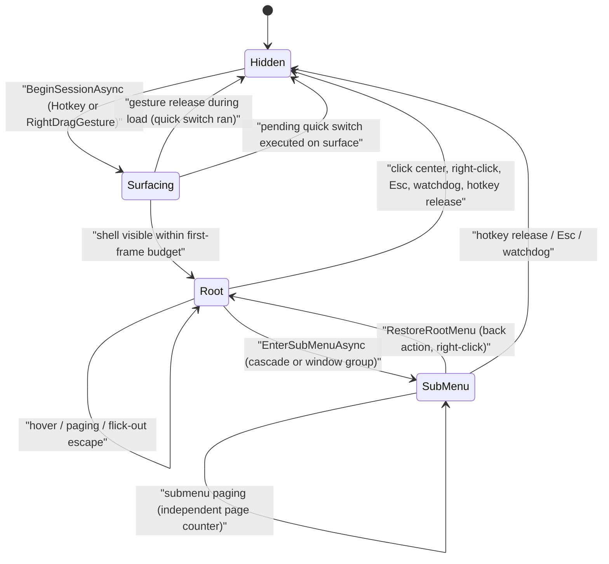

# Radial Menu Session & Interaction Runtime

Every radial-menu invocation in Pulsar — whether summoned by a hotkey or by a right-drag gesture — runs through one deep, pure-logic module: `MenuSession` (`Pulsar/Pulsar/ViewModels/MenuSession.cs`). It owns the session state machine: visibility, the hovered slot, root and submenu paging, the submenu morph choreography, input policy decisions, hit-testing, the inactivity watchdog, and the gesture-summon/release orchestration. The `RadialMenuViewModel` is deliberately thin — an input-source adapter plus a binding projection (ADR-008 decision 2, completed by ADR-020) — and the `RadialMenuWindow` view renders whatever the session projects.

The architecture splits into three concentric layers:

1. **Session layer** (`MenuSession` + its pure state machine): all interaction decisions, reachable from tests without a WPF shell. It depends on interfaces only (`IUiDispatcher`, `IAnimationController`, `ISlotLayoutEngine`, `IPagingController`, `IPageProviderFactory`, `ISubMenuLayoutEngine`, `ISubMenuStrategy`, `IGestureIsolationService`, `IGlobalMouseService`, `IMenuViewportService`, ...).
2. **Projection layer** (`RadialMenuViewModel`): subscribes to input sources on the Dispatcher (hotkey, global mouse, mouse tracking, config updated), forwards raw events into `MenuSession.HandleXxx`, listens to `MenuSession.PropertyChanged`, and re-raises the ~20 view-facing binding properties (`Slots`, `CenterSlot`, `IsVisible`, `IsFlickOutEscaped`, `MenuCanvasLeft/Top`, `DynamicTitle`, previews, ...). It holds no interaction logic.
3. **View layer** (`RadialMenuWindow.xaml/.cs`, `SlotOrb.xaml`): binds to the projection, owns pure visuals (summon/dismiss fades, parallax, paging-nudge animations) and the full-screen viewport expansion/collapse through `MenuViewportService`.

The `IMenuSession` interface (`Pulsar/Pulsar/ViewModels/IMenuSession.cs`) is the seam strategies use: `IsVisible`, `IsInSubMenu`, `SetActionExecuted`, `RestoreRootMenu`, `EnterSubMenuAsync`. Slot strategies (`PluginActionStrategy`, `WindowSwitchStrategy`, ...) depend on it — never on the ViewModel — so the session's input/state decisions can be tested with four-member mocks (ADR-008 decision 3).

## Responsibilities and Entry Points

`MenuSession` is registered as a DI singleton (`App.xaml.cs` `AddSingleton<MenuSession>()`) and injected into `RadialMenuViewModel`. All public entry points are synchronous `HandleXxx`/`FeedXxx` methods (or the async session lifecycle):

| Entry point | Caller | Responsibility |
|---|---|---|
| `Initialize()` | VM constructor | Loads the config snapshot, validated `SlotsPerPage`, creates the slot ring, configures the animation controller, subscribes to `IPagingController.OnBoundaryReached`, loads the initial gesture config |
| `BeginSessionAsync(mode, invocationSource)` | VM `ShowAsync` / gesture summon | One invocation: capture `PulsarContext`, reset selection, lay out slots, run the deadline-bounded content load, surface the shell |
| `OnHotkeyInvoked(e)` | VM hotkey adapter | Captures the release trigger (`HotkeyInvocationSnapshot`); a second hotkey while pending/visible is suppressed so it cannot resolve the current session |
| `HandleKeyUp(e, releasePosition)` | VM key-up adapter | Escape cancels; suppresses foreign hotkey releases; hotkey modifier release runs quick-switch or `ExecuteSelectionAsync`; a submenu transition never consumes the owning key's release |
| `FeedRightDragGesture(e)` / `FeedGlobalMouseMove(e)` | VM global-mouse adapters | The right-drag summon state machine: modifier discrimination, isolation filter, pending swallow (LEAK-FIX), replay, threshold summon, gesture release |
| `HandleGlobalMouseClickAsync(button, slotIndex, relative)` | VM click adapter | Left-click policy (center dismiss/back/execute, slot execute, submenu entry); right-click restores root or dismisses |
| `HandleMouseWheel` / `HandleSubMenuMouseWheel` | VM wheel adapter | Root paging via `IPagingController`; submenu paging via the independent `_subMenuPage` counter |
| `HandlePointerMoved(relative)` | VM mouse-tracking adapter | Hover: flick-out escape tracking, magnetism, hit-test, active-slot update |
| `HitTest(relative)` | VM / tests | Pure window-relative DIP hit-test (root ring or cascade sub-layout) |
| `RefreshConfig(snapshot)` | VM config adapter | Single config-update entry point: gesture config (with D3 mid-gesture deferral) plus live layout reconfiguration |
| `CancelActiveMenu()` | window Esc / external | Cancels the current session, restoring root first when in a submenu |
| `SetWindowHandle` / `SetMenuCenter` / `GetInvocationPointScreen` | window code-behind | Viewport plumbing |
| `Touch()` | VM event adapter | Marks interaction so the watchdog does not dismiss |

The VM forwards every hotkey/mouse event it receives from its input sources and lets the session decide: `OnGlobalMouseEvent` calls `_session.FeedRightDragGesture(e)` first, and only when that returns false and the menu is visible does it route viewport gating, wheel paging, and click hit-testing to the session (`RadialMenuViewModel.cs#L226-L290`).

## Session State Machine

The session has two explicit `MenuState` values (`Root`, `SubMenu`) plus the visibility/transition/loading dimensions that gate every input decision:



Caption: One invocation's lifecycle: the shell surfaces within a first-frame budget, hover/paging happen on the root ring, a submenu morph (glide/collapse/bloom) moves the menu to `SubMenu`, and every exit path (selection, cancel, escape, flick-out, watchdog) ends in `Hidden`.

Key gating rules that make the state machine safe:

- **`_isTransitioning` blocks all input.** During the submenu morph every pointer/keyboard input is ignored so a partially-morphed menu can never be acted upon (`MenuSession.cs#L1438-L1443`, `#L1949`). The hotkey release of the key that owns the menu lifetime is the exception: it cancels the transition and closes synchronously (`#L1726-L1765`).
- **`_isLoading` is an atomic interlocked guard** on `BeginSessionAsync` so a second summon while one is surfacing is a no-op (`#L571`). A gesture release during the load aborts the surface (`_gestureReleaseHandledDuringLoad`).
- **`_sessionGeneration` + `_sessionCts` discard stale loads.** Each `LoadPageContentAsync` bumps the generation and captures it; a newer session, or dismissal (which cancels the token via the `IsVisible` setter), makes the in-flight load discard its result (`#L794-L798`, `#L823-L826`).
- **`InvocationSource` drives the input policy.** Gesture-summoned sessions execute only on the right-button release; a keyboard/hotkey release must never trigger them (`HandleKeyUp` returns early when `IsGestureSummoned`, `#L1706-L1709`). The source resets to `Hotkey` on dismiss (`#L386`).

## Summon Paths: Hotkey vs Right-Drag Gesture

There are two invocation sources (`MenuInvocationSource.Hotkey`, `MenuInvocationSource.RightDragGesture`).

**Hotkey path** — the VM registers the Show Grid/Show Switcher hotkey actions and forwards `HotkeyInvocationEventArgs` to `_session.OnHotkeyInvoked(e)`, then `ShowAsync(mode)` applies radial rendering (`ApplyRadialRendering`) and calls `BeginSessionAsync(mode, Hotkey)`. The session keeps keyboard-release semantics: a `HotkeyInvocationSnapshot` records the hotkey's modifier set, `HandleKeyUp` matches its release (via `MatchesRelease`/`ConsumeRelease`), and a fast release inside the center zone triggers **quick switch** (policy: `QuickSwitchPolicy.MaxDuration` default 250 ms, `CenterZoneRadius` default 30 px, clamped from settings). A second hotkey observed while a session is pending or visible is added to `_suppressedHotkeyReleases` so its release cannot resolve the current session (`#L1796-L1810`).

**Right-drag gesture path** — the session owns the whole orchestration (moved from the VM by ADR-020):

- `FeedRightDragGesture` is the entry for every global mouse hook event, before the VM's menu-visible handling. It claims events when the gesture feature is enabled, a gesture press is in flight, or a gesture-summoned menu is visible.
- `RightDragGestureDetector` (`Pulsar/Pulsar/ViewModels/RightDragGestureDetector.cs`) is a pure state machine. At right-button DOWN it reads the held modifier (switcher → Task menu, action → Action menu; action wins when both held) and returns a decision: `ActionSummon`/`SwitcherSummon` (swallow + summon), `None` (pass through). In `Immediate` mode the menu is summoned at down; in `OnThreshold` mode `FeedDisplacement` crossing `_gestureDragThreshold` (default 25 px) summons exactly once.
- **Isolation filter (D4)**: a denied right-down never enters the detector or pending state — it passes through to the foreground application untouched (`#L1072-L1087`). `GestureIsolationService` decides from `ForegroundWindowFacts` + cached `ProfileSettings` (allowlist/blocklist/block-fullscreen with 2-px tolerance) with all native reads behind `IGestureIsolationNative`.
- **LEAK-FIX pending swallow**: when the gesture is enabled but no modifier is detected at down (unreliable `GetAsyncKeyState` on the hook thread, or `ResetModifierState` cleared the keyboard hook's tracked state), the down is swallowed into `_pendingGestureDown` instead of passing through. The modifier is re-checked on the first real drag move and at release: held → promote to gesture; not held → `ReplayRightClick` so the source app's native context menu still appears (`#L1122-L1144`, `ResolvePendingGestureUp`, `FeedGlobalMouseMove`).
- **Sub-threshold release (D2)**: in `OnThreshold` mode a claimed press that never crossed the threshold replays a synthetic right-click instead of resolving the menu (`#L1167-L1177`).
- **Release handling**: `GestureRelease` dispatches `HandleGestureRightReleaseAsync` at input priority (`IUiDispatcher.InvokeWithInputPriority`, `DispatcherPriority.Input` — D4). The release hides the menu synchronously, waits `MenuTiming.DismissAwait`, then resolves spatially: flick-out escape → cancel; center zone → quick switch; otherwise `ExecuteSelectionAsync` (`#L1560-L1638`).
- **Config lifecycle (D3)**: `RefreshGestureConfig` never resets an in-flight detector — a config refresh mid-gesture is deferred into `_pendingGestureConfig` and applied on the next release/pass-through up (`#L911-L930`).
- **Gesture warm-up**: `SummonGestureMenu` runs `_rendererWarmup(mode)` on the UI thread before `BeginSessionAsync`, for parity with the hotkey path. The composition root wires the callback as `sp => mode => sp.GetRequiredService<RadialMenuViewModel>().ApplyRadialRendering(mode)` — the VM is resolved lazily at first invocation so there is no construction cycle (`App.xaml.cs#L344-L345`). This callback is the session's only reverse touch to the VM.

<!-- openwiki: mermaid parse failed and this diagram was converted to a text fence so it does not break rendering. Fix the diagram source and restore the mermaid fence. Parser error: Heuristic: a semicolon inside a label breaks rendering; rephrase the label. -->
```text
flowchart TD
    Hook[Global mouse hook event] --> Feed[VM forwards to session.FeedRightDragGesture]
    Feed --> Pending{swallowed pending down?}
    Pending -->|yes, right-up| ResolvePending[ResolvePendingGestureUp: promote or replay]
    Feed --> Guard{gesture-enabled or press in flight or visible gesture menu?}
    Guard -->|no| Pass[event passes to app, Handled=false]
    Guard -->|yes| Down{right-button down?}
    Down -->|yes| Iso{isolation allows?}
    Iso -->|denied| Pass
    Iso -->|allowed| Mod{configured modifier held?}
    Mod -->|yes| Summon[swallow; Immediate summons now / OnThreshold waits]
    Mod -->|no, enabled| PendingDown[swallow pending; re-check on move or release]
    Down -->|no, right-up| Up{detector decision}
    Up -->|GestureRelease| Release[HandleGestureRightReleaseAsync at input priority]
    Up -->|SubThresholdRelease| Replay[ReplayRightClick to source app]
    Up -->|None| Pass
    Release --> Hide[IsVisible = false synchronously]
    Hide --> Fade[await MenuTiming.DismissAwait 180ms]
    Fade --> Escape{escaped flick-out?}
    Escape -->|yes| Cancel[gesture cancelled, nothing runs]
    Escape -->|no| Zone{release in center zone?}
    Zone -->|yes| QS[quick switch to previous window]
    Zone -->|no| Execute[ExecuteSelectionAsync on hovered slot]
```

Caption: The right-drag gesture detector's event flow: every hook event is claimed or passed through, and a gesture release hides the menu synchronously before the fade-delayed selection resolves spatially.

## The Invocation Contract: Hide Before Execution

Two hard rules protect the menu from re-triggering its own hooks:

1. **The menu hides before plugin execution.** `PluginActionStrategy.ExecuteAsync` calls `context.SetActionExecuted(true)` then `context.IsVisible = false` before invoking `IPluginExecutor` — a plugin that simulates input (e.g. Ctrl release) must never re-trigger the hotkey hook while the menu is still visible. `WindowSwitchStrategy` hides first for the same reason (focus-steal avoidance) and sets `FocusRestoreMode.NoRestore` so the menu dismiss cannot undo the switch (`SlotStrategies.cs#L67-L76`, `#L150-L157`).
2. **Gesture release waits for the dismiss fade.** `HandleGestureRightReleaseAsync` hides synchronously (D4) and then awaits `MenuTiming.DismissAwait` (180 ms) before running the selection. `MenuTiming` (`Pulsar/Pulsar/ViewModels/MenuTiming.cs`) is the cross-module timing contract: `DismissFade` (160 ms, started by `RadialMenuWindow.Dismiss`) must be ≤ `DismissAwait` (160 + 20 ms grace). If the await were shorter than the fade, slot strategies (which block the UI thread during window activation, ~300 ms) would starve the fade animation and leave a visible ghost of the menu.

The dismiss chain also drives the viewport teardown: `Dismiss` clears live preview, plays the 160 ms fade, then on completion calls `ClearVisuals`, `MenuViewportService.CollapseViewport` (shrinks the window back to 1×1), and `FocusManager.ReleaseAsync` (`RadialMenuWindow.xaml.cs#L198-L231`).

## BeginSession: Deadline-Bounded Content Load

`BeginSessionAsync` (`#L568-L723`) guarantees the shell appears even when the page provider is slow:

- **Phase 1 (surface)**: capture `PulsarContext`, reset selection, compute layout metrics via `_layoutCoordinator.GetLayoutMetrics`, position the center slot, sync the animation controller, start the content load, and race it against the **first-frame budget** (default 50 ms, injectable in tests).
- **Single-phase vs two-phase**: when the load lands inside the budget the model is applied before `IsVisible = true` — the menu appears fully populated. When it misses, the shell surfaces within the budget and the still-running load patches content in (the empty-wheel flash is bounded by the budget, and a genuine failure while the session is current triggers exactly one background retry, `#L717-L721`).
- **Warm cache seeding**: Task mode seeds the provider from `IWindowInventoryCoordinator.TryGetCached` when available — a cache hit completes inside the budget and the desktop is never re-enumerated (pinned by `MenuSessionTwoPhaseOpenTests`). A cache miss must keep the seed null (not a non-null empty list), otherwise the provider would treat it as a valid warm cache and gray out every running app (`#L636-L641`).
- **Dismiss pre-warm**: Task-mode dismiss calls `_inventoryCoordinator.PrewarmOnMenuDismiss()` — the menu's own dismiss is not a desktop change, so without this a peek→dismiss→reopen cycle would re-enumerate instead of reusing the fresh snapshot (`#L403-L410`).
- **Retry-on-failure**: a slow load that failed while the session is still current is retried once in the background so the shell is never left empty (`#L717-L721`).

Content itself comes from **page providers** created by the `IPageProviderFactory` seam (ADR-023, `Pulsar/Pulsar/ViewModels/Strategies/PageProviderFactory.cs`): `CreateProcessPage` for the Task/Switch menu (window enumeration through `IWindowInventoryCoordinator`, seeding from the cached snapshot) and `CreateCommandPage` for the Action menu (profile slots from config, with the `internal:create_profile` creator slot inserted at index 0 when no profile matches the active process). The factory holds all 13 fixed singleton dependencies so `MenuSession` only passes per-session data — the previous `IServiceProvider` service-locator pattern (20 `GetService` calls across the execution path) is gone.

## Paging: Two Independent Counters

Paging semantics are split per menu level (ADR-011):

- **Root wheel**: `IPagingController` (`Pulsar/Pulsar/Services/PagingController.cs`) owns the root page. Boundary events fire `OnBoundaryReached`, which the session maps to the `OnPagingBoundaryFeedbackRequested` event (nudge animation) plus a transient center hint. Single-page menus show a localized "single page" hint once per session (`#L1855-L1864`).
- **Submenu**: the session's own `_subMenuPage` / `_subMenuTotalPages` counters. Entering any submenu resets the sub-page to 0 and leaves the root page untouched — paging never crosses the level boundary (`#L2517`). `HandleMouseWheel` dispatches by `_menuState`: `SubMenu` → `HandleSubMenuMouseWheel`, else root paging. First/last submenu pages emit `OnPagingBoundaryFeedbackRequested` instead of wrapping (`#L1907-L1916`).
- **Shared page size**: the sub-ring reuses the root's `SlotsPerPage` (4–12, clamped) — there is no separate submenu page size. A cascade's total pages are `ceil(SubSlots.Count / SlotsPerPage)`.
- **`SlotsPerPage` live change**: `UpdateSlotsPerPage` (from the `SlotsPerPageChangedMessage` messenger on the VM) clamps to 4–12, rebuilds the slot ring through `_layoutCoordinator.RebuildSlots`, animates to the new geometry, and refreshes the page provider's visuals.

## Submenu Morph and Cascade Submenu Strategies

Entering a submenu is `EnterSubMenuAsync(descriptor, clickedSlotIndex)` (the `IMenuSession` seam). The descriptor (`SubMenuDescriptor` subclasses: `WindowSubMenuDescriptor`, `CascadeSubMenuDescriptor`) identifies a strategy by `StrategyId`; `RadialMenuSubMenuCoordinator` (`Pulsar/Pulsar/ViewModels/RadialMenuSubMenuCoordinator.cs`) routes the descriptor to the registered `ISubMenuStrategy` (`window-switch`, `cascade` — both registered in `App.xaml.cs`) and configures the center + child slots. An unknown strategy id logs a warning and **falls back to the root menu — never throws** (`FallbackToRoot`).

The morph itself lives in `EnterSubMenuAsyncCore` (`#L2491-L2693`), a coordinated animation over `IAnimationController`/direct pose animation:

- The clicked slot **glides to the center** (scale 1.0–1.45), other root slots and the center slot **collapse** (scale 0.45, opacity 0), and the whole menu **translates** toward the click point. Travel duration is distance-adaptive (`GetSubMenuEnterDuration`, 110–240 ms; bloom 150–230 ms).
- During the morph `_isTransitioning = true` gates every input path; a hotkey release cancels the transition (`_subMenuTransitionCts`) and closes synchronously.
- When the morph lands, the center slot becomes the **Back action** (`BackActionStrategy`), the center label carries the page indicator when the submenu has more than one page (`UpdateSubMenuCenterLabel`), the clicked slot is pre-selected (when enabled and non-`None`), and the submenu's default-target window primes the center preview (`PrimeSubMenuPreview`, delayed 300 ms).
- `RestoreRootMenuAsync` reverses the choreography (collapse toward the submenu origin, glide back, bloom) and re-applies the root page provider's visuals synchronously — never an async reload, so root slots do not "pop" mid-morph.

The **cascade strategy** (`CascadeSubMenuStrategy`, id `cascade`) maps each page's `SubSlotDescriptor`s onto child slots with the full plugin pipeline (`PluginActionStrategy`); children whose plugin/action is unknown are disabled, empty page slots become `NoOpStrategy` fillers.

## Layout Geometry Engines

All geometry is window-relative DIP; no engine applies a DPI transform (the viewport service already converted screen → DIP).

**Root ring — `SlotLayoutEngine`** (`Pulsar/Pulsar/Services/SlotLayoutEngine.cs`, `ISlotLayoutEngine` seam): pure math for the 4–12 slot disc. Slot `i` sits at angle `-90° + (i-1) * 360/total` on the optimal radius; radius/slot-size/center-size/dead-zone all scale with slot count (radius clamped to 180 px, slot size 38–60, center 55–85, dead-zone ratio 0.60–0.65). `HitTest` returns 0 inside the dead zone, otherwise the sector index. `CalculateOptimalRadius` is reused by flick-out escape tracking so the escape radius tracks the wheel, not the sub-ring.

**Cascade sub-layout — `SubMenuLayoutEngine`** (`Pulsar/Pulsar/Services/SubMenuLayoutEngine.cs`, `ISubMenuLayoutEngine` seam): deterministic Ring/Fan geometry. **Fan** caps at three wings (±30° about the parent direction, center tip for 1–2 children); more children on the page fall back to **Ring** (even angular intervals from the parent direction). The engine receives a `SubMenuParentPose` (center, parent direction, sub-ring radius, slot size, dead zone) that the session builds in `BuildCascadeParentPose` (`#L2025-L2044`): the sub-ring radius is `clamp(rootRadius * 0.60, 20, canvasSafeArea - halfSlot)`, where the safe area is the minimum distance from the menu center to each canvas edge. Ring hit-testing checks the slot band then the angular sector; Fan hit-testing picks the wing with the smallest angular difference (`HitTestFan`, StarPie's `HitTestFanSubs` model).

**Hit-testing is page-scoped (ADR-011 decision 5)**: `HitTestCascadeSubMenu` computes the child count from `GetCascadePageChildCount` — the same page window the strategy filled — so children on other pages are never hit-testable; there is no scroll-into-view while hovering.

## Viewport and Placement

`MenuViewportService` (`Pulsar/Pulsar/Services/MenuViewportService.cs`, `IMenuViewportService`) owns the full-screen interaction surface. The radial window is a resident 1×1 window expanded per summon:

- `PrepareViewport(window, menuExtentDip, cursorScreenPoint?)` resolves the monitor under the cursor (or the recorded invocation point), queries the per-monitor DPI after relocating the window (required on mixed-DPI systems), computes the DIP work area, and clamps the **menu center** so the 500×500 canvas plus its visual extent (`MenuVisualExtentDip = 260`) stays inside the work area (`ClampMenuCenter`, pure static math).
- `RequiresPointerWarp` detects when clamping moved the center away from the cursor; `RadialMenuWindow.Summon` then warps the physical pointer onto the center so the "menu follows pointer" invariant is restored (`RadialMenuWindow.xaml.cs#L152-L160`).
- While the menu is open the full-screen window owns all pointer input: `IsPointInActiveViewport` gates clicks — wheel inside pages, wheel outside is swallowed, clicks outside on Up dismiss (and the click is swallowed so it cannot hit the desktop).
- `CollapseViewport` shrinks the window back to 1×1 (kept on the current monitor so the next `PrepareViewport` starts from the correct DPI context) and clears `CurrentLayout`.

## Watchdog and Failure Semantics

- **Inactivity watchdog**: `StartMenuWatchdog` on visible kicks a loop that dismisses the menu after 60 s without `Touch()` — a stuck gesture or lost release can never leave the menu on screen (`#L2819-L2864`).
- **Stale-load protection**: the `_sessionGeneration` counter plus per-session `CancellationTokenSource` guarantee a slow provider can never apply visuals to a closed or superseded session (the `IsVisible` setter cancels the token).
- **Gesture leak protection**: the visible-gesture-menu guard swallows a right-up even when detector state was lost (e.g. an external `Reset`), so a gesture-held menu never leaks its release to the source app (`#L1046-L1054`).
- **Hotkey ownership**: a hotkey received while a session is pending or visible never replaces the release key that owns the current session — it is suppressed and its release consumed without effect (`#L1802-L1806`, `TryConsumeSuppressedHotkeyRelease`).

## Testability and Focused Tests

ADR-008's core payoff is that `MenuSessionTests` construct the session directly with mocks — no WPF, no reflection, no `Application` instance. The test surface that matters:

- `MenuSessionTests` (`Pulsar/Pulsar.Tests/ViewModels/MenuSessionTests.cs`): dead-zone hit-testing, hover activation, click-dismiss policy, all through the `ISlotLayoutEngine` mock + `DirectUiDispatcher`.
- `MenuSessionTwoPhaseOpenTests`: the deadline contract — shell surfaces within the budget while the provider is pending; dismissed/superseded loads never apply; warm-cache seed skips re-enumeration; Task-mode dismiss pre-warms the inventory.
- `MenuSessionGestureTests`: invocation-source tracking, gesture-release-only execution, Escape still cancels gesture menus, hotkey suppression while visible/pending.
- `RightDragGestureIsolationTests` / `RightDragGestureLeakTests`: session-driven harnesses for the D4 isolation gate and the LEAK-FIX pending swallow/promote/replay.
- `CascadeSubMenuStrategyTests` / `CascadeSubMenuEntryTests` / `SubMenuCoordinatorStrategyTests` / `WindowSwitchSubMenuStrategyTests`: per-strategy slot configuration, fallback-to-root on unknown ids, page windows.
- `DirectUiDispatcher` (`Pulsar/Pulsar.Tests/TestHelpers/DirectUiDispatcher.cs`) is the single shared dispatcher fake (consolidated from nine per-file copies by ADR-020).
